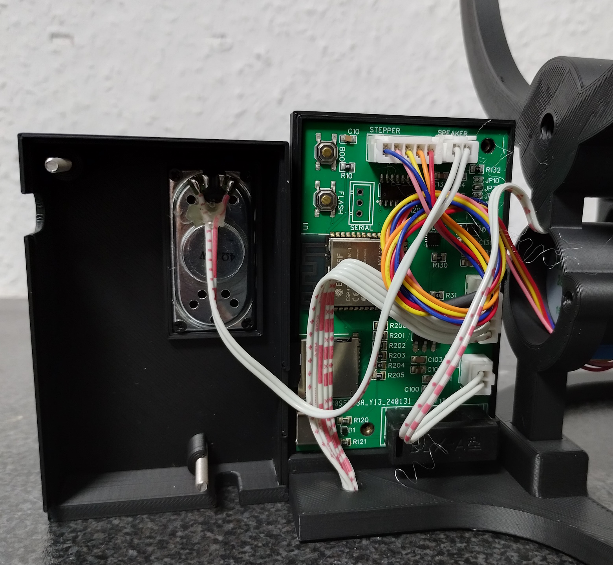
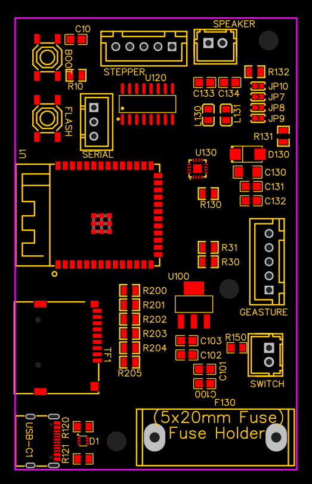
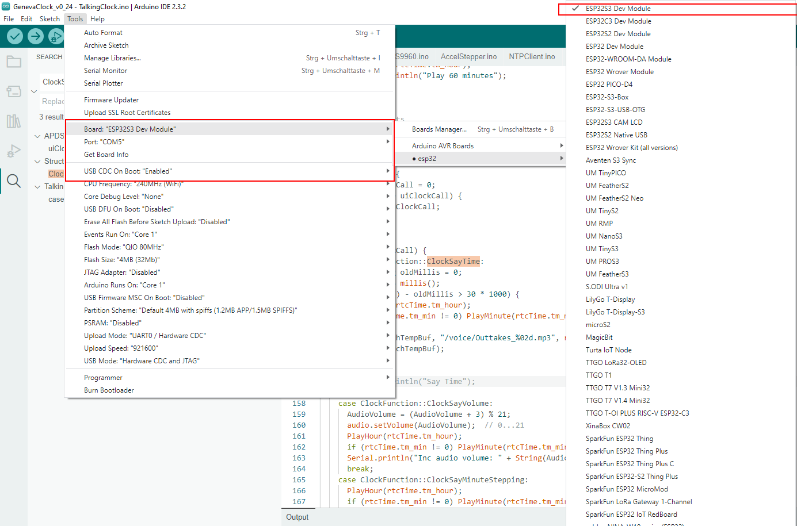

# ESP32_GenevaClock_Board
ESP32 S3 custom board for gzumwalt GenevaClock including Sound output.
This project is not based on any files from gzumwalt, the Arduino Project is a complete re-write.

## Used Libaries
- AccelStepper https://github.com/waspinator/AccelStepper
- Melopero_APDS9960 https://github.com/melopero/Melopero_APDS-9960

## Arduino debugging configuration

